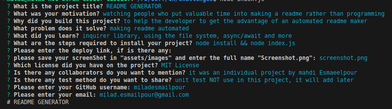

# README GENERATOR

  ## Description

  - watching people who put valuable time into making a readme rather than programming

  - to help the developer to get the advantage of an automated readme maker

  - making readme automated

  - inquirer library, using the file system, async/await and more

  ## Table of Contents
  - [Installation](#installation)

  - [Usage](#usage)

  - [Credits](#credits)

  - [License](#license)

  ## Installation

  ```
node install && node index.js
```

  ## Usage
  [Walkthrough video](https://drive.google.com/file/d/1dRreTxzXUM6juxolYQrLbaa36LR88lA1/view)
  
  

  ## Credits

  it was an individual project by mahdi Esmaeelpour

  ## License

  [MIT License](https://choosealicense.com/licenses/mit/)

  ---
  ## Badges

  
  ## Tests

  unit test NOT use in this project, it will add later

  ## Questions

  please contact for more information via

  [GitHub](https://github.com/miladesmailpour)
  or
  milad.esmailpour@gmail.com 
  
